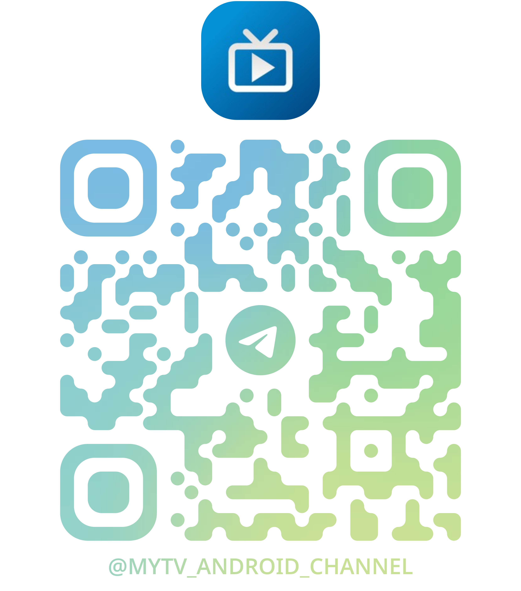

    <h1>电视直播TV</h1>

  <a href="README.md">🇨🇳 中文</a> | <a href="README_EN.md">🇺🇸 English</a>

    
基于天光云影3.3.9，使用Android原生开发的电视直播软件

<!--  -->
 
<!-- 
 -->

## 使用

[使用文档](https://mytv-android.github.io/mytv-doc)

## 下载

可以通过右侧release进行下载

## 姊妹项目
- [北京卫视订阅源](https://github.com/mytv-android/BRTV-Live-M3U8)
- [部分地方台订阅源](https://github.com/mytv-android/China-TV-Live-M3U8)
- [节目单项目](https://github.com/mytv-android/myEPG)
- [频道标志项目](https://github.com/mytv-android/myTVlogo)
- [JS订阅源](https://github.com/mytv-android/mytvJS)
- [migu订阅源项目](https://github.com/mytv-android/myMIGU)

## 相关项目
- [rtphttpd - IPTV转发工具] (https://github.com/stackia/rtp2httpd)

## 参与开发

由于项目开源引来大量的分发（Star:Fork 比例为 5:1），且这些分发者不能自行解决其渠道用户的反馈，项目目前将不再公开源代码。

不过，如果你有兴趣，仍然可以申请参与开发，我们在组织内部维护了一个分支，所有拥有访问权限的开发者都可以查看、编辑和提交。

你可以通过issue来联系我们。

## 信息获取

交流（此群一般不作为反馈bug，提供建议之处，相关内容请发布至issue），都请关注此频道以获取最新改进，以及更新投票计划。

    

## 星标历史

<a href="https://star-history.dera.page/#mytv-android/mytv-android&Date">
 <picture>
   <source media="(prefers-color-scheme: dark)" srcset="https://star-history.dera.page/svg?repos=mytv-android/mytv-android&type=Date&theme=dark" />
   <source media="(prefers-color-scheme: light)" srcset="https://star-history.dera.page/svg?repos=mytv-android/mytv-android&type=Date" />
   
 </picture>
</a>

## 著作权、许可证声明和致谢

- 本软件基于天光云影（https://github.com/yaoxieyoulei/mytv-android/tree/feature/ui ）进行迭代，在此感谢作者 yaoxieyoulei 的无私奉献。天光云影使用的MIT许可证请参见[天光云影许可证](./LICENSE_ORIGIN)。

- 本软件还使用了BV（https://github.com/aaa1115910/bv ）的部分代码，在此特感谢aaa1115910。[许可证](./LICENSE_PART1)。
