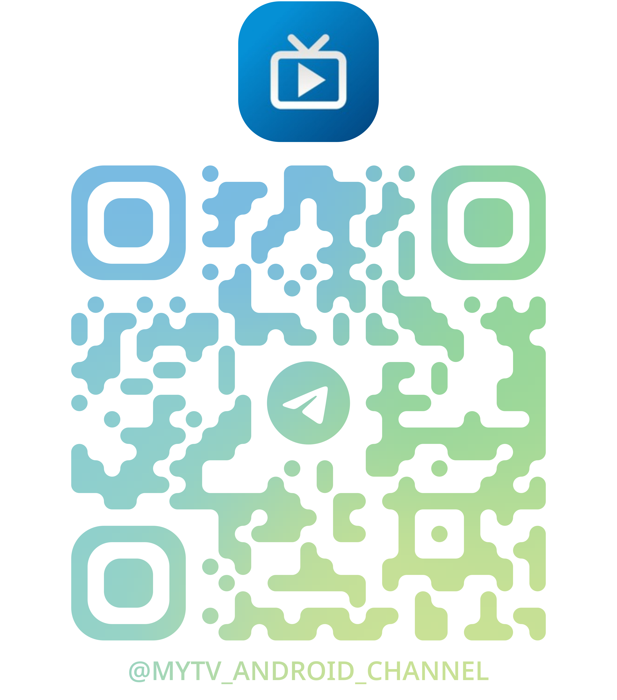

    <h1>TV LiveTV</h1>

  <a href="README.md">🇨🇳 中文</a> | <a href="README_EN.md">🇺🇸 English</a>

A TV live player app developed with native Android library.

<!--  -->
 

<!-- 
 -->

## Usage

### How to Operate

- Use the remote control or touch gestures to navigate and select channels.
- Supports Android TV and TV boxes.

### Touch Key Mapping

- The app maps touch gestures to remote control keys for easier navigation.

### Custom Settings

- Visit the following URL: `http://<device IP>:10591` to access the web configuration page.

## Download

You can download releases from the right sidebar or clone the code and build locally.

## Notes

- Only supports Android 5.0 and above.
- Only tested on my own TV, stability on other devices is unknown.

## Information (Chinese language only)

For communication (this group is generally not for bug feedback or suggestions, please use issues for those) and beta information release, please follow this channel to get the latest updates and participate in update voting.

    

## Star History

<a href="https://www.star-history.com/#mytv-android/mytv-android&Date">
 <picture>
   <source media="(prefers-color-scheme: dark)" srcset="https://api.star-history.com/svg?repos=mytv-android/mytv-android&type=Date&theme=dark" />
   <source media="(prefers-color-scheme: light)" srcset="https://api.star-history.com/svg?repos=mytv-android/mytv-android&type=Date" />
   
 </picture>
</a>

## Copyright, License Statement, and Acknowledgements

- This software is based on Tianguang Yunying ([https://github.com/yaoxieyoulei/mytv-android/tree/feature/ui](https://github.com/yaoxieyoulei/mytv-android/tree/feature/ui)). Special thanks to the author yaoxieyoulei for their selfless contribution. Tianguang Yunying uses the MIT license, see [Tianguang Yunying License](./LICENSE_ORIGIN). If you copy the software code, please retain this license and the original author's copyright statement.
- This software uses the GNU license, see [Project License](./LICENSE). You are free to distribute and derive from this software. However, when distributing or deriving from this code, you cannot change the license; you must open source your modified code; and you must retain the relevant statements of this software.
- This software also uses parts of BV ([https://github.com/aaa1115910/bv](https://github.com/aaa1115910/bv)). Special thanks to aaa1115910. [License](./LICENSE_PART1).